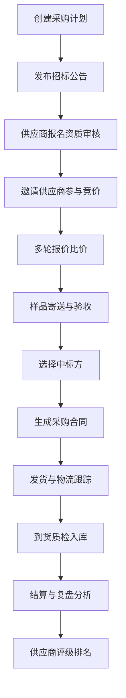
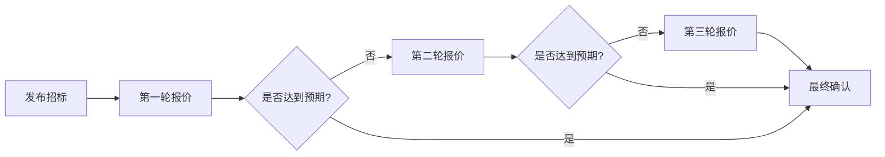

# 大蒜跨区采购竞价平台 - 产品需求文档

## 1. 产品概述

大蒜跨区采购竞价平台是一个面向连锁餐饮、调味品厂和供应商的B2B集中采购管理系统。通过多轮竞价、样品验收和履约跟踪等全流程数字化管理，帮助企业实现大蒜采购的透明化、规范化和成本优化。

**核心价值：**
- 汇聚优质供应商资源，降低采购成本
- 标准化竞价流程，提升采购效率
- 全流程质量追溯，保障供货品质
- 数据化运营分析，优化采购决策

## 2. 核心功能

### 2.1 用户角色

| 角色 | 描述 | 核心权限 |
|------|------|----------|
| 采购方 | 连锁餐饮、调味品厂等 | 创建采购计划、发布招标、管理供应商、签订合同、履约跟踪、结算复盘 |
| 供应商 | 大蒜种植户、批发商、合作社 | 报名参与、提交资质、报价竞价、样品寄送、合同签订、发货履约 |
| 管理员 | 平台运营方 | 用户管理、数据监控、规则配置 |

### 2.2 功能模块

**8大核心功能页面：**

1. **采购计划** - 制定年度/季度采购计划，创建采购批次
2. **招标大厅** - 发布招标信息，管理招标批次状态
3. **供应商报名** - 供应商资质审核与报名管理
4. **报价比价** - 多轮竞价、含税含运自动汇总
5. **样品验收** - 样品评分、质量评估
6. **合同确认** - 合同生成、双方确认
7. **履约跟踪** - 发货、物流、到货全流程跟踪
8. **结算复盘** - 补货扣款、节省金额、供应商排名

## 3. 核心业务流程

### 3.1 采购全流程

### 3.2 竞价流程

## 4. 页面详细设计

### 4.1 采购计划页面

**核心模块：**
- 年度/季度采购计划表
- 采购批次创建表单
  - 批次名称、编号
  - 规格等级（紫皮/白皮、特级/一级/二级）
  - 需求量（吨）
  - 到货时间、到货地点
  - 质量标准
  - 预算单价区间
- 计划进度追踪
- 历史计划查询

**关键交互：**
- 拖拽式批次调整
- 批量导入采购需求
- 自动计算预算总额
- 与招标大厅一键联动

### 4.2 招标大厅页面

**核心模块：**
- 招标公告列表
  - 批次编号、名称
  - 招标状态（草稿/报名中/竞价中/已截止/已完成）
  - 报名供应商数量
  - 剩余时间倒计时
- 招标详情面板
  - 采购规格明细
  - 质量要求说明
  - 竞价规则展示
  - 时间节点日历
- 招标批次管理
  - 创建新招标
  - 编辑招标信息
  - 邀请指定供应商
  - 取消/延期招标

**关键交互：**
- 状态筛选与搜索
- 一键发布到供应商端
- 实时报名人数统计
- 招标进度甘特图

### 4.3 供应商报名页面

**核心模块：**
- 待审核供应商列表
  - 企业基本信息
  - 资质证照上传
  - 历史合作记录
  - 信用评分
- 资质审核表单
  - 营业执照
  - 食品经营许可证
  - 产地证明
  - 质量认证证书
  - 过往业绩证明
- 审核历史记录
- 黑名单管理

**关键交互：**
- 批量资质预览
- 在线证照核验
- 自动信用评分计算
- 一键通过/拒绝

### 4.4 报价比价页面

**核心模块：**
- 竞价批次选择
- 供应商报价表
  - 单价（含税）
  - 运费
  - 到货价（含税含运）
  - 最小起订量
  - 报价有效期
- 多轮竞价控制
  - 当前轮次设置
  - 轮次时间控制
  - 竞价规则配置
- 价格汇总分析
  - 自动排序（按到货价）
  - 价格走势图
  - 市场份额分析
  - 历史价格参考

**关键交互：**
- 匿名/非匿名竞价切换
- 价格自动汇总计算
- 供应商排名实时更新
- 导出比价报表

### 4.5 样品验收页面

**核心模块：**
- 待验收样品列表
  - 供应商信息
  - 样品规格
  - 快递单号
  - 送达时间
- 样品评分表
  - 外观评分（色泽、饱满度、均匀度）
  - 规格评分（大小、整齐度）
  - 品质评分（水分、干物质含量）
  - 口感评分（辛辣度、香味）
- 综合评分计算
- 验收历史存档

**关键交互：**
- 扫码快速入库
- 图片对比上传
- 评分表自定义配置
- 批量验收操作

### 4.6 合同确认页面

**核心模块：**
- 合同模板管理
- 合同预览面板
  - 采购双方信息
  - 标的规格明细
  - 价格条款
  - 交付条款
  - 质量标准
  - 违约责任
  - 争议解决
- 合同审批流程
  - 内部审批
  - 供应商确认
  - 电子签章
- 合同签署状态追踪

**关键交互：**
- 合同自动生成填充
- 在线签署确认
- 合同版本对比
- 短信/邮件提醒签署

### 4.7 履约跟踪页面

**核心模块：**
- 订单列表总览
  - 合同编号
  - 供应商信息
  - 订单数量
  - 交付状态
- 发货管理
  - 发货时间登记
  - 物流单号录入
  - 运输方式选择
- 物流轨迹追踪
  - 实时位置更新
  - 预计到达时间
  - 异常预警
- 到货确认
  - 到货时间登记
  - 外观验收
  - 质检结果登记
- 异常处理
  - 延迟预警
  - 破损登记
  - 补货申请
  - 扣款处理

**关键交互：**
- 物流轨迹可视化
- 到货扫码确认
- 异常情况一键上报
- 补货/扣款流程触发

### 4.8 结算复盘页面

**核心模块：**
- 结算管理
  - 应付账款明细
  - 付款申请流程
  - 已付款/待付款状态
- 补扣款记录
  - 质量扣款明细
  - 延迟扣款明细
  - 补货记录
- 成本分析报表
  - 实际采购成本 vs 预算
  - 节省金额统计
  - 环比/同比分析
- 履约分析
  - 准时交货率
  - 质量合格率
  - 供应商履约评分
- 供应商排名
  - 综合排名
  - 价格排名
  - 质量排名
  - 交期排名

**关键交互：**
- 财务报表一键导出
- 多维度数据筛选
- 可视化图表展示
- 历史数据对比分析

## 5. 用户界面设计

### 5.1 设计风格

**主题定位：专业、可靠、高效**
- 采用清晰的数据仪表盘风格
- 强调信息层次与操作效率
- 保持商业系统的专业感

**色彩方案：**
- 主色：深青绿色 #10B981（象征农业、信任）
- 辅色：深灰色 #374151（专业、稳重）
- 强调色：橙色 #F59E0B（价格、竞价）
- 警示色：红色 #EF4444 / 绿色 #22C55E
- 背景色：浅灰白 #F9FAFB
- 卡片色：纯白 #FFFFFF

**字体选择：**
- 标题：思源黑体 Bold / Noto Sans SC Bold
- 正文：思源黑体 Regular / Noto Sans SC Regular
- 数据：DIN Alternate / Roboto Mono

**按钮风格：**
- 圆角按钮（border-radius: 8px）
- 悬停阴影效果
- 明确的点击反馈

**布局方式：**
- 左侧固定导航 + 右侧内容区
- 卡片式信息展示
- 表格与卡片混合布局
- 顶部搜索筛选栏

**图标风格：**
- 使用线性图标（Feather Icons风格）
- 统一线条粗细
- 保持简洁易识别

### 5.2 页面布局规范

**统一框架：**
- 顶部导航栏：Logo + 用户信息 + 消息通知
- 左侧菜单栏：8大功能入口（可折叠）
- 右侧内容区：面包屑 + 主内容 + 分页

**卡片设计：**
- 白色背景
- 轻微阴影（box-shadow: 0 1px 3px rgba(0,0,0,0.1)）
- 圆角边框（border-radius: 12px）
- 内边距（padding: 24px）

**表格设计：**
- 斑马纹行背景
- 悬停高亮
- 固定表头
- 可排序列头

### 5.3 响应式设计

- 桌面端优先设计
- 平板适配（导航折叠）
- 移动端简化展示（关键数据卡片化）

## 6. 数据指标体系

### 6.1 核心业务指标

| 指标 | 计算方式 | 展示位置 |
|------|----------|----------|
| 采购批次数 | 统计周期内创建批次 | 采购计划页 |
| 参与供应商数 | 活跃供应商总数 | 招标大厅 |
| 平均竞价轮次 | 总轮次 / 批次总数 | 报价比价 |
| 中标节省率 | (预算 - 实付) / 预算 × 100% | 结算复盘 |
| 准时交货率 | 准时订单数 / 总订单数 × 100% | 结算复盘 |
| 质量合格率 | 合格订单数 / 总订单数 × 100% | 履约跟踪 |
| 供应商评分 | 加权平均（价格+质量+交期） | 结算复盘 |

### 6.2 供应商评分维度

- 价格竞争力（权重30%）
- 产品质量（权重35%）
- 交货准时性（权重20%）
- 服务配合度（权重15%）

## 7. 安全与权限

### 7.1 权限控制

- 采购方：完整采购流程管理
- 供应商：仅可见自己的招标和订单
- 管理员：全系统管理权限

### 7.2 数据安全

- 合同电子签章加密存储
- 交易数据备份机制
- 操作日志完整记录
