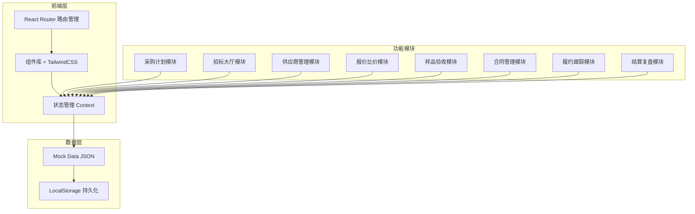
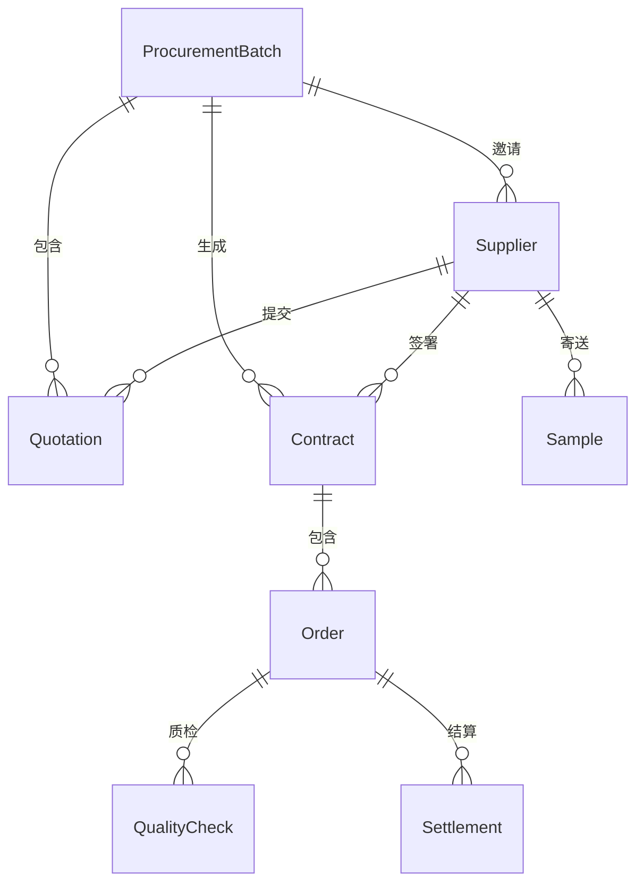

# 大蒜跨区采购竞价平台 - 技术架构文档

## 1. 架构设计

### 1.1 系统架构图



### 1.2 技术栈选型

- **前端框架：** React 18 + Vite
- **样式方案：** TailwindCSS 3
- **路由管理：** React Router DOM v6
- **UI组件：** 自定义组件库
- **图标库：** Heroicons
- **图表库：** Recharts
- **数据模拟：** Mock JSON Data
- **状态管理：** React Context API
- **构建工具：** Vite 5

## 2. 路由定义

| 路由路径 | 页面名称 | 核心组件 |
|---------|---------|----------|
| `/` | 首页/仪表盘 | Dashboard |
| `/plan` | 采购计划 | ProcurementPlan |
| `/bidding` | 招标大厅 | BiddingHall |
| `/suppliers` | 供应商报名 | SupplierRegistration |
| `/quotation` | 报价比价 | QuotationComparison |
| `/sample` | 样品验收 | SampleInspection |
| `/contract` | 合同确认 | ContractConfirmation |
| `/fulfillment` | 履约跟踪 | PerformanceTracking |
| `/settlement` | 结算复盘 | SettlementReview |

## 3. 数据模型

### 3.1 数据模型定义



### 3.2 核心数据结构

#### 3.2.1 采购批次 (ProcurementBatch)

```typescript
interface ProcurementBatch {
  id: string;
  batchNumber: string;
  name: string;
  type: '紫皮' | '白皮';
  grade: '特级' | '一级' | '二级';
  quantity: number; // 吨
  unitPrice: number; // 元/吨
  budgetTotal: number; // 预算总额
  deliveryDate: string;
  deliveryLocation: string;
  qualityStandard: string;
  status: '草稿' | '招标中' | '竞价中' | '已截止' | '已完成';
  createdAt: string;
  updatedAt: string;
}
```

#### 3.2.2 供应商 (Supplier)

```typescript
interface Supplier {
  id: string;
  companyName: string;
  contactPerson: string;
  phone: string;
  location: string;
  qualifications: {
    businessLicense: string;
    foodLicense: string;
    originCertificate: boolean;
    qualityCertificate: boolean;
  };
  creditScore: number;
  status: '待审核' | '已通过' | '已拒绝' | '黑名单';
  registeredAt: string;
}
```

#### 3.2.3 报价 (Quotation)

```typescript
interface Quotation {
  id: string;
  batchId: string;
  supplierId: string;
  unitPrice: number; // 含税单价
  freight: number; // 运费
  totalPrice: number; // 含税含运
  minOrder: number; // 最小起订量
  validUntil: string;
  round: number; // 竞价轮次
  submittedAt: string;
}
```

#### 3.2.4 样品 (Sample)

```typescript
interface Sample {
  id: string;
  batchId: string;
  supplierId: string;
  trackingNumber: string;
  appearanceScore: number; // 外观评分
  specScore: number; // 规格评分
  qualityScore: number; // 品质评分
  tasteScore: number; // 口感评分
  totalScore: number;
  status: '待验收' | '已验收';
  receivedAt: string;
}
```

#### 3.2.5 合同 (Contract)

```typescript
interface Contract {
  id: string;
  contractNumber: string;
  batchId: string;
  supplierId: string;
  totalAmount: number;
  deliveryDate: string;
  paymentTerms: string;
  status: '待确认' | '已签署' | '执行中' | '已完成';
  createdAt: string;
  signedAt: string;
}
```

#### 3.2.6 订单 (Order)

```typescript
interface Order {
  id: string;
  contractId: string;
  quantity: number;
  actualDeliveryDate: string;
  logisticsNumber: string;
  status: '待发货' | '运输中' | '已到货' | '质检中';
  issues: Issue[];
}
```

#### 3.2.7 结算 (Settlement)

```typescript
interface Settlement {
  id: string;
  contractId: string;
  orderId: string;
  totalAmount: number;
  deductions: number; // 扣款
  replenishment: number; // 补货
  finalAmount: number;
  status: '待付款' | '已付款';
  paidAt: string;
}
```

## 4. 组件结构

### 4.1 布局组件

```
src/components/layout/
├── MainLayout.jsx          # 主布局框架
├── Sidebar.jsx             # 侧边导航栏
├── TopBar.jsx              # 顶部导航栏
└── PageHeader.jsx          # 页面标题组件
```

### 4.2 通用组件

```
src/components/common/
├── DataTable.jsx           # 数据表格组件
├── StatCard.jsx            # 统计卡片组件
├── Modal.jsx               # 模态框组件
├── Form.jsx                # 表单组件
├── Badge.jsx               # 状态徽章组件
├── Button.jsx              # 按钮组件
├── Input.jsx               # 输入框组件
└── Select.jsx              # 选择器组件
```

### 4.3 业务组件

```
src/components/procurement/
├── BatchForm.jsx           # 批次创建表单
├── BatchList.jsx           # 批次列表
└── ProgressTracker.jsx     # 进度追踪器

src/components/bidding/
├── BiddingCard.jsx         # 招标卡片
├── SupplierList.jsx        # 供应商列表
└── Timeline.jsx            # 时间轴组件

src/components/quotation/
├── PriceTable.jsx          # 价格对比表
├── QuoteForm.jsx           # 报价表单
└── PriceChart.jsx          # 价格走势图

src/components/sample/
├── SampleCard.jsx          # 样品卡片
├── ScoreTable.jsx          # 评分表
└── ImageCompare.jsx        # 图片对比

src/components/contract/
├── ContractPreview.jsx     # 合同预览
├── SignaturePanel.jsx      # 签署面板
└── StatusTracker.jsx       # 状态追踪

src/components/fulfillment/
├── OrderCard.jsx           # 订单卡片
├── LogisticsTracker.jsx   # 物流追踪
└── IssueForm.jsx           # 异常表单

src/components/settlement/
├── SettlementTable.jsx     # 结算表格
├── DeductionForm.jsx       # 扣款表单
└── RankChart.jsx           # 排名图表
```

## 5. 页面详细设计

### 5.1 采购计划页面

**功能说明：**
- 创建和管理采购批次
- 设置规格等级和到货时间
- 追踪采购计划执行进度

**核心组件：**
- BatchForm：批次创建/编辑表单
- BatchList：批次列表展示
- ProgressTracker：计划执行进度

**数据流：**
1. 用户填写批次信息 → BatchForm
2. 提交数据 → Context 更新状态
3. 更新批次列表显示 → BatchList

### 5.2 招标大厅页面

**功能说明：**
- 发布和管理招标公告
- 展示招标批次状态
- 邀请供应商参与竞价

**核心组件：**
- BiddingCard：招标信息卡片
- StatusFilter：状态筛选器
- Timeline：招标时间轴

### 5.3 供应商报名页面

**功能说明：**
- 接收供应商资质资料
- 审核供应商资质
- 管理供应商状态

**核心组件：**
- QualificationList：资质列表
- ReviewForm：审核表单
- StatusBadge：状态徽章

### 5.4 报价比价页面

**功能说明：**
- 展示供应商报价
- 自动汇总含税含运价格
- 多轮竞价控制

**核心组件：**
- PriceTable：价格对比表
- QuoteForm：报价输入
- PriceChart：价格趋势图
- RankingBoard：排名看板

### 5.5 样品验收页面

**功能说明：**
- 记录样品信息
- 多维度评分
- 样品对比

**核心组件：**
- SampleCard：样品卡片
- ScoreTable：评分表格
- ImageCompare：图片对比器

### 5.6 合同确认页面

**功能说明：**
- 生成采购合同
- 双方确认签署
- 合同版本管理

**核心组件：**
- ContractPreview：合同预览
- SignaturePanel：签署面板
- VersionCompare：版本对比

### 5.7 履约跟踪页面

**功能说明：**
- 追踪订单发货状态
- 物流轨迹可视化
- 处理异常情况

**核心组件：**
- OrderCard：订单卡片
- LogisticsTracker：物流追踪器
- IssueForm：异常处理表单

### 5.8 结算复盘页面

**功能说明：**
- 处理结算付款
- 记录扣款补货
- 展示数据分析

**核心组件：**
- SettlementTable：结算表格
- DeductionForm：扣款表单
- RankChart：供应商排名图表
- SavingsCard：节省金额卡片

## 6. Mock数据设计

### 6.1 数据文件结构

```
src/data/
├── batches.json           # 采购批次数据
├── suppliers.json         # 供应商数据
├── quotations.json        # 报价数据
├── samples.json           # 样品数据
├── contracts.json         # 合同数据
├── orders.json            # 订单数据
└── settlements.json       # 结算数据
```

### 6.2 模拟数据示例

**供应商数据示例：**
```json
{
  "id": "sup-001",
  "companyName": "山东金乡大蒜合作社",
  "contactPerson": "张经理",
  "phone": "138-0000-1234",
  "location": "山东省济宁市金乡县",
  "qualifications": {
    "businessLicense": "verified",
    "foodLicense": "verified",
    "originCertificate": true,
    "qualityCertificate": true
  },
  "creditScore": 95,
  "status": "已通过",
  "registeredAt": "2024-01-15"
}
```

**批次数据示例：**
```json
{
  "id": "batch-001",
  "batchNumber": "PO-2024-001",
  "name": "2024年春季大蒜采购",
  "type": "紫皮",
  "grade": "一级",
  "quantity": 50,
  "unitPrice": 8000,
  "budgetTotal": 400000,
  "deliveryDate": "2024-05-01",
  "deliveryLocation": "上海市浦东新区",
  "status": "竞价中"
}
```

## 7. 状态管理

### 7.1 Context结构

```typescript
// src/context/AppContext.jsx
const AppContext = createContext();

// 状态结构
{
  batches: [], // 采购批次列表
  suppliers: [], // 供应商列表
  quotations: [], // 报价列表
  samples: [], // 样品列表
  contracts: [], // 合同列表
  orders: [], // 订单列表
  settlements: [], // 结算列表
  
  // 操作方法
  addBatch: (batch) => {},
  updateBatch: (id, updates) => {},
  addSupplier: (supplier) => {},
  updateSupplier: (id, updates) => {},
  // ... 其他操作方法
}
```

### 7.2 LocalStorage持久化

```javascript
// 数据持久化策略
useEffect(() => {
  // 初始化时从LocalStorage加载数据
  const savedData = localStorage.getItem('garlic-procurement-data');
  if (savedData) {
    setState(JSON.parse(savedData));
  }
}, []);

useEffect(() => {
  // 数据变更时保存到LocalStorage
  localStorage.setItem('garlic-procurement-data', JSON.stringify(state));
}, [state]);
```

## 8. 性能优化

### 8.1 代码分割

```javascript
// 使用React.lazy进行路由级代码分割
const ProcurementPlan = lazy(() => import('./pages/ProcurementPlan'));
const BiddingHall = lazy(() => import('./pages/BiddingHall'));
```

### 8.2 组件优化

- 使用 React.memo 缓存纯展示组件
- 使用 useMemo 缓存计算结果
- 使用 useCallback 缓存回调函数
- 虚拟列表优化长列表渲染

### 8.3 样式优化

- TailwindCSS JIT模式
- 提取关键CSS
- 压缩CSS体积

## 9. 项目初始化

### 9.1 初始化命令

```bash
npm create vite@latest garlic-procurement -- --template react
cd garlic-procurement
npm install react-router-dom@6
npm install -D tailwindcss postcss autoprefixer
npx tailwindcss init -p
npm install @heroicons/react recharts
```

### 9.2 目录结构

```
garlic-procurement/
├── public/
│   └── vite.svg
├── src/
│   ├── components/
│   │   ├── layout/
│   │   ├── common/
│   │   └── [feature]/
│   ├── pages/
│   │   ├── Dashboard.jsx
│   │   ├── ProcurementPlan.jsx
│   │   ├── BiddingHall.jsx
│   │   ├── SupplierRegistration.jsx
│   │   ├── QuotationComparison.jsx
│   │   ├── SampleInspection.jsx
│   │   ├── ContractConfirmation.jsx
│   │   ├── PerformanceTracking.jsx
│   │   └── SettlementReview.jsx
│   ├── context/
│   │   └── AppContext.jsx
│   ├── data/
│   │   └── mockData.js
│   ├── utils/
│   │   └── helpers.js
│   ├── App.jsx
│   ├── main.jsx
│   └── index.css
├── .gitignore
├── index.html
├── package.json
├── tailwind.config.js
├── postcss.config.js
└── vite.config.js
```

## 10. 开发规范

### 10.1 组件命名

- 使用 PascalCase 命名组件：`ProcurementPlan.jsx`
- 使用 camelCase 命名辅助函数：`calculateTotal.js`
- 使用 kebab-case 命名样式类：`bg-emerald-500`

### 10.2 代码规范

- 使用 ES6+ 语法
- 使用 PropTypes 或 TypeScript 定义类型
- 组件控制在 200 行以内
- 提取复用逻辑到 hooks
- 注释关键业务逻辑

### 10.3 Git提交规范

```
feat: 新功能
fix: 修复bug
docs: 文档更新
style: 代码格式调整
refactor: 重构
test: 测试相关
chore: 构建/工具相关
```

## 11. 部署方案

### 11.1 构建命令

```bash
npm run build
```

### 11.2 部署配置

- 静态文件部署到 CDN
- 使用 Nginx 配置 SPA 路由
- 配置缓存策略
- 启用 Gzip 压缩

### 11.3 环境变量

```env
VITE_APP_TITLE=大蒜跨区采购竞价平台
VITE_APP_VERSION=1.0.0
```
